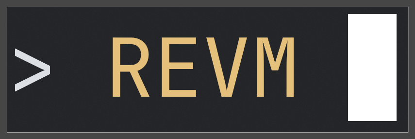

<p align="center">
  
</p>
<h1 align="center"><b>revm</b></h1>
<p align="center">revm helps you quickly launch Linux VMs / Containers</p>

[](https://github.com/ihexon/revm/actions/workflows/build.yml)

> [!WARNING]
> This project is currently under heavy development

[README_EN](./README.md) | [README_ZH](./README_zh.md)

A lightweight Linux microVM for macOS powered by [libkrun](https://github.com/containers/libkrun). Two independent
modes: **chroot mode** (run commands inside an isolated Linux rootfs) and **docker mode** (run a full Podman container
engine on Apple Silicon).

## Requirements

macOS Sonoma or later

## Installation

```bash
wget https://github.com/ihexon/revm/releases/download/<TAG>/chroot-Darwin-arm64.tar.xz

xattr -d com.apple.quarantine chroot-Darwin-arm64.tar.xz

tar -xvf chroot-Darwin-arm64.tar.xz
```

Use `dockerd-Darwin-arm64.tar.xz` for the container engine.

## Command Overview

The release archive ships independent executables for each mode:

| Command   | What it does                                                                            |
|-----------|-----------------------------------------------------------------------------------------|
| `chroot`  | Boot a Linux microVM from a custom or built-in rootfs, then run a command inside it     |
| `dockerd` | Boot the built-in container VM and expose a Podman-compatible API socket on the host    |


## Quick Start

```bash
# Run a command inside a rootfs-backed VM
chroot --id build --rootfs ~/ubuntu-rootfs -- bash -lc 'uname -a'

# Start the built-in container engine
dockerd --id engine
export CONTAINER_HOST=unix:///tmp/engine/socks/podman-api.sock
podman run --rm alpine uname -a
```

---

## Documentation

| Document                                  | Description                                                                     |
|-------------------------------------------|---------------------------------------------------------------------------------|
| [chroot mode](docs/chroot-mode.md)        | Linux chroot alternative on macOS — run any rootfs with near-native performance |
| [docker mode](docs/docker-mode.md)        | Full container engine without Docker Desktop — Podman/Docker CLI compatible     |
| [workspace & networking](docs/insider.md) | Session directory layout, reuse/cleanup, and network backends (gvisor / tsi for chroot only)    |
| [management API](docs/management-api.md)  | VM management API via Unix socket                                               |

## Bug Reports

https://github.com/ihexon/revm/issues

## License

Apache License 2.0 — see [LICENSE](./LICENSE) for details.

> Some parts of this document were written using AI assistance because I was lazy.
